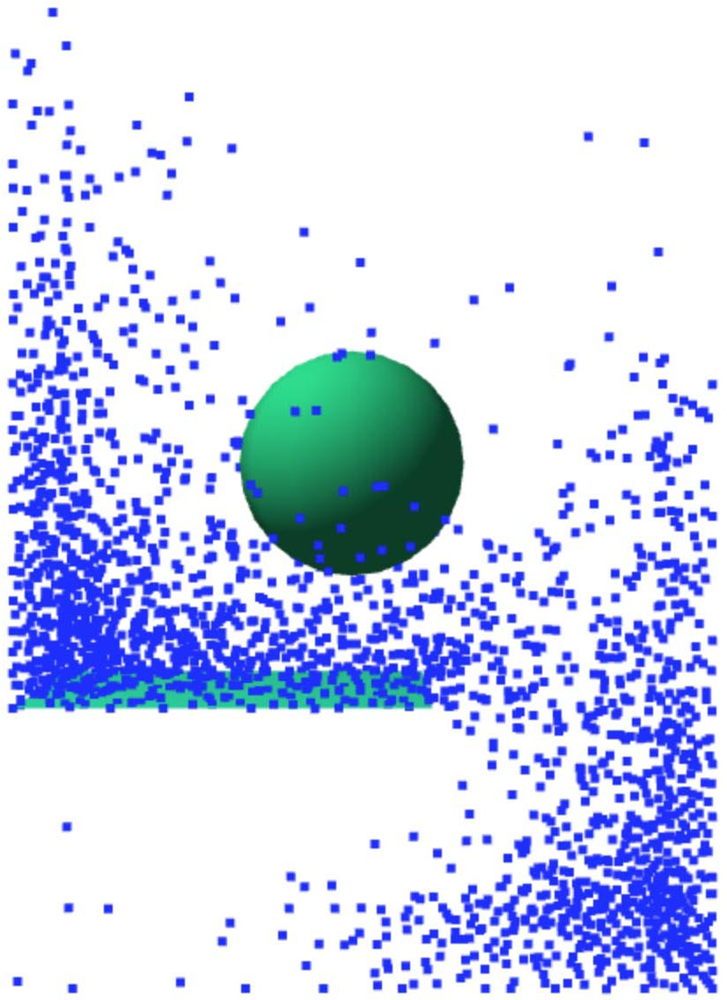

# Descripion

SPH fluid simulation based on Mathias Müller paper "Particle-Based Fluid Simulation for Interactive Applications". The implementation follows the lagrangian viewport.

# Execute 
Install a local server if needed with

`npm install http-server -g`

and run with

`http-server .`